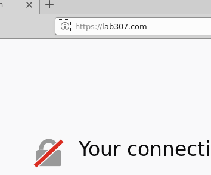
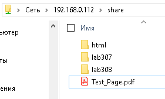
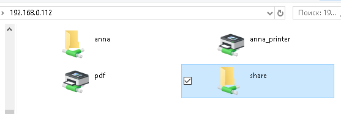

# Подготовка к экзамену

* [Настройка служб](#настройка-служб)
  * [FTP](#ftp-vsftpd)
    * [Базовая конфигурация](#базовая-конфигурация)
    * [Виртуальные пользователи](#виртуальные-пользователи)
  * [WEB](#web-apache2)
    * [Базовая конфигурация](#базовая-конфигурация)
    * [Виртуальные пользователи](#виртуальные-пользователи)
    * [SSL](#ssl)
  * [DNS](#dns-bind9)
    * [Прямая DNS запись](#прямая-dns-запись)
    * [Обратная DNS запись](#обратная-dns-запись)
  * [SAMBA](#samba)
* [Исправление неисправностей](#исправление-неисправностей)
  * [`error: no such device`](#error-no-such-device)
  * [Смена пароля `root`](#cмена-пароля-root)
  * [Бесконечный рестарт системы](#бесконечный-рестарт-системы)
  
## Настройка служб

### FTP (vsftpd)

#### Базовая конфигурация

Установка:

```bash
apt install vsftpd
```

Главный конфиг - `/etc/vsftpd.conf`.

Разрешим авторизацию существующих в операционной системе пользователей:

```bash
$ nano /etc/vsftpd.conf

local_enable=YES

$ service vsftpd restart
```

Проверяем в Windows:

```bash
ftp> open 192.168.0.112
Связь с 192.168.0.112.
220 (vsFTPd 3.0.3)
200 Always in UTF8 mode.
Пользователь (192.168.0.112:(none)): anna
331 Please specify the password.
Пароль:
230 Login successful.
ftp>
```

Добавим загрузку файлов на сервер из-под пользователя:

```bash
$ nano /etc/vsftpd.conf

write_enable=YES

$ service vsftpd restart
```

Проверяем:

```bash
ftp> put C:\test\test.txt
200 PORT command successful. Consider using PASV.
150 Ok to send data.
226 Transfer complete.
```


Ограничим домашнюю директорию через `chroot`, чтобы исключить возможность выхода пользователя на `ftp` за пределы своей домашней директории:

```bash
$ nano /etc/vsftpd.conf

chroot_local_user=YES
allow_writeable_chroot=YES # разрешаем использовать домашние каталоги с правом на запись

$ service vsftpd restart
```

Проверяем:

```bash
ftp> cd /var
550 Failed to change directory.
```

Включим анонимных пользователей на `ftp`, доступных под пользователем `anonymous`:

```bash
$ nano /etc/vsftpd.conf

anonymous_enable=YES
anon_upload_enable=YES # разрешает или запрещает запись в каталог анонимного пользователя
anon_mkdir_write_enable=YES # разрешает в том же самом каталоге создание каталогов

$ service vsftpd restart
```

Привяжем пользователя `anonymous` к аккаунту `ftp`:

```bash
mkdir /srv/ftp/upload
chown ftp:ftp /srv/ftp/upload

$ nano /etc/vsftpd.conf

local_umask = 022

$ service vsftpd restart
```

```bash
ftp> open 192.168.0.112
Связь с 192.168.0.112.
220 (vsFTPd 3.0.3)
200 Always in UTF8 mode.
Пользователь (192.168.0.112:(none)): ftp
331 Please specify the password.
Пароль:
230 Login successful.
ftp> ls
200 PORT command successful. Consider using PASV.
150 Here comes the directory listing.
upload
226 Directory send OK.
ftp: 11 байт получено за 0.00 (сек) со скоростью 11.00 (КБ/сек).
ftp>
```

**Реализовали сценарий загрузки анонимным пользователем данных в каталог upload и запрету именения и удаления файлов в других директориях, посредством настройки прав доступа UNIX.**

#### Виртуальные пользователи

Создадим виртуальных пользователей:

```bash
apt-get install apache2-utils libpam-pwdfile
htpasswd -c /etc/virtusers ivan # создаём файл с паролями, структура как у /etc/passwd
```

Полученный формат не подходит для библиотеки `libpam-pwdfile`.


Нужна опция `-d`:

```bash
htpasswd -c -d /etc/virtusers ivan # Use  crypt()  encryption for passwords
```


```bash
less /usr/share/doc/libpam-pwdfile/README
```

### WEB (apache2)

#### Базовая конфигурация

```bash
apt-get install apache2
```

По умолчанию для `http` порт `80`, для `https` - `443`, проверим, что сервер стартанул:

```bash
service apache2 status
```

Дефолтный сайт доступен поадресу `http://localhost`.

Заменим дефолтный сайт:

```bash
cp /var/www/html/index.html ~/
echo '<html><p>HELLO<p></html>' > /var/www/html/index.html
```

Заголовок `Host` позволяет реализовать механизм виртуальных хостов (Virtual hosts) - когда на одном физическом `ip` расположено несколько сайтов.

Главная конфигурация `apache2` находится в файле `/etc/apache2/apache2.conf`, этот файл подключает все остальные конфигурационные файлы.

Сделаем виртуальный хост:

```bash
cp /etc/apache2/sites-enabled/000-default.conf /etc/apache2/sites-available/lab308.conf

DocumentRoot /var/www/lab308
ServerName lab308.com
```

```bash
mkdir /var/www/lab308
echo '<html><p><b>HELLO, lab308</b><p></html>' > /var/www/lab308/index.html
```

Создаём символическую ссылку в каталоге `/etc/apache2/sites-enabled`:

```bash
a2ensite
systemctl reload apache2 # все открытые соединения останутся открытыми,  т.е. пользователь ничего не заметит
```

Чтобы протестировать, нужно добавить запись в файл `/etc/hosts`:

```bash
<ip addr> lab308.com
```


**Посмотри Windows Hosts**! (`C:\Windows\System32\drivers\etc\hosts`)

#### Виртуальные пользователи

Создадим виртуальных пользователей для Apache (базовая аунтефикация):

```bash
apt-get install apache2-utils
htpasswd -c /var/www/lab308/.htpasswd ivan # создаём файл с паролями, структура как у /etc/passwd
htpasswd /var/www/lab308/.htpasswd tolik # добавляем ещё одного пользователя
```

Прописываем защищаемый ресурс в конфигурацию сайта:

```bash
nano /var/www/lab308/.htaccess # изменения будут подхватываться на лету

AuthType Basic
AuthName "Private zone!"
AuthUserFile /var/www/lab308/.htpasswd
require user ivan tolik # доступ только для пользователей ivan и tolik
#require valid-user # доступ для всех прошедших авторизацию
```

Можно настроить групповой доступ:

```bash
nano /var/www/lab308/.htgroup

admins: administrator
users: tolik ivan
```

```bash
# .htaccess: доступ к секретной области сайта имеют только члены группы admins
AuthType Basic
AuthName "Private Area"
AuthUserFile /var/www/html/secret/.htpasswd
AuthGroupFile /var/www/html/secret/.htgroup
Require group admins
```

Разрешаем  получение настроек из файла `.htaccess`:

```bash
nano /etc/apache2/apache2.conf

<Directory /var/www/lab308/>
        Options Indexes FollowSymLinks
        AllowOverride All # чтобы файл .htpasswd обрабатывался сервером
        Require all granted
</Directory>
```

```bash
systemctl reload apache2.service
```


Взято [отсюда](http://web.archive.org/web/20161104102804/http://unixa.ru/web/autentifikatsiya-sredstvami-apache-web-server.html).

#### SSL

```bash
a2enmod ssl # активируем модуль ssl
systemctl restart apache2
```

Добавим default-ssl в доступные сайты:

```bash
a2ensite default-ssl
```


Добавим self-signed сертикфикат для `lab307.com`:

```bash
sudo make-ssl-cert /usr/share/ssl-cert/ssleay.cnf /etc/ssl/certs/lab307cert # этот файл содержит private key и certificate
```

```bash
cp /etc/apache2/sites-available/default-ssl.conf /etc/apache2/sites-available/lab307.conf
nano /etc/apache2/sites-available/lab307.conf

<IfModule mod_ssl.c>
        <VirtualHost *:443>
                ServerAdmin webmaster@localhost
                ServerName lab307.com
                DocumentRoot /var/www/lab307

                ErrorLog ${APACHE_LOG_DIR}/error.log
                CustomLog ${APACHE_LOG_DIR}/access.log combined

                SSLEngine on

                SSLCertificateFile      /etc/ssl/certs/lab307cert

        </VirtualHost>
</IfModule>
```



?

```bash
openssl s_client -connect lab307.com:443
CONNECTED(00000003)
depth=0 CN = debian
verify error:num=18:self signed certificate
verify return:1
depth=0 CN = debian
verify return:1
---
Certificate chain
 0 s:/CN=debian
   i:/CN=debian
---
Server certificate
-----BEGIN CERTIFICATE-----
MIICxTCCAa2gAwIBAgIJAKzK0GhuJ+I
```

**Дополнительно установили модуль поддержки  динамических сайтов на php, через модуль libapache2-mod-php.Для существующего сайта с доменом  lab306.com создали динамическую страницу на php, содержащую вызов функции phpinfo();**!? - надо ли это разбирать

### DNS (bind9)

#### Прямая DNS запись

Установка:

```bash
apt install bind9
```

Главный конфигурационный файл `/etc/bind/named.conf`.

Добавим зону для `lab309.com`:

```bash
nano /etc/bind/named.conf.local

zone "lab309.com" {
        type master;
        file "/var/lib/bind/db.lab309";
};
```

```bash
cp /etc/bind/db.local /var/lib/bind/db.lab309
```

```bash
nano /var/lib/bind/db.lab309

# admin.lab309.com - email админа
# NS - name server
# A - IPv4
# MX - почта, 10 - приоритет почтового сервера
# CNAME - canonical name=alias
;
; BIND data file for local loopback interface
;
$TTL    604800
@       IN      SOA     lab309.com. admin.lab309.com. (
                              2         ; Serial
                         604800         ; Refresh
                          86400         ; Retry
                        2419200         ; Expire
                         604800 )       ; Negative Cache TTL
;
@       IN      NS      lab309.com.
@       IN      A       192.168.0.112
www     IN      A       192.168.0.112
@       IN      MX 10   mail1
@       IN      MX 20   mail2
mail1   IN      A       192.168.0.111
mail1   IN      A       192.168.0.110
ftp     IN      CNAME   @
```

Чтобы разрешить запросы внутри локальной сети (не только с `localhost`), нужно добавить строку `allow-query { any; };` в `/etc/bind/named.conf.options`.

Проверим конфиг:

```bash
named-checkconf
named-checkzone lab309.com /var/lib/bind/db.lab309
```

Перезагружаем/запускаем `bind9`:

```bash
service bind9 restart
```

Проверяем:

```bash
$ cat /etc/resolv.conf

nameserver 192.168.0.1

$ apt install dnsutils
$ nslookup
```


Проверяем `mail`:

```bash
$ nslookup
> set type=MX
> mail1.lab309.com

╤хЁтхЁ:  [192.168.0.112]
Address:  192.168.0.112

lab309.com
        primary name server = lab309.com
        responsible mail addr = admin.lab309.com
        serial  = 2
        refresh = 604800 (7 days)
        retry   = 86400 (1 day)
        expire  = 2419200 (28 days)
        default TTL = 604800 (7 days)
```

Удобнее проверять с помощью `dig`:

```bash
dig @127.0.0.1 lab309.com MX
```

Внесём изменения в файл, отвечающий за разрешение DNS:

```bash
nano /etc/resolv.conf

#nameserver 192.168.0.1
nameserver 127.0.0.1 # force to use local DNS server
```

Проверяем:

```bash
$ ping lab309.com
PING lab309.com (192.168.0.112) 56(84) bytes of data.

$ dig lab309.com
```

#### Обратная DNS запись

```bash
$ cp /etc/bind/db.127 /var/lib/bind/db.192
$ nano /etc/bind/named.conf.local

# 0.168.192 - первые три октета IPv4 в обратном порядке
zone "lab309.com" {
        type master;
        file "/var/lib/bind/db.lab309";
};

zone "0.168.192.in-addr.arpa" {
        type master;
        file "/var/lib/bind/db.192";
};


$ /var/lib/bind/db.192

# 112 - последний октет IPv4
;
; BIND reverse data file for local loopback interface
;
$TTL    604800
@       IN      SOA     lab309.com. admin.lab309.com. (
                              1         ; Serial
                         604800         ; Refresh
                          86400         ; Retry
                        2419200         ; Expire
                         604800 )       ; Negative Cache TTL
;
@       IN      NS      lab309.com.
112     IN      PTR     lab309.com.
```

Проверяем конфиг и рестартуем:

```bash
named-checkconf
named-checkzone 0.168.192.in-addr.arpa /var/lib/bind/db.192
service bind9 restart
```

Проверяем работоспособность:

```bash
dig -x 192.168.0.112
```

### SAMBA

Установка:

```bash
apt-get install samba
```

Конфиг общий для сервера и клиента - `/etc/samba/smb.conf`.

Пробуем зайти с Windows через проводник - `\\192.168.0.112\anna` - не пускает, т.к. нужно добавить существующего пользователя Unix через `smbpasswd`:

```bash
smbpasswd -a anna
```

Добавим публичную "шару":

```bash
nano /etc/samba/smb.conf

[share]
   comment = Shara with name "share"
   path = /srv/ftp
   browseable=yes
```

Рестартуем:

```bash
service smbd restart
```


Чтобы не требовался пароль при доступе к `share`:

```bash
nano nano /etc/samba/smb.conf

# после map to guest
guest account = anna
...
[share]
   comment = Shara with name "share"
   path = /srv/ftp
   browseable=yes
   guest ok=yes
```

Если до этого входили в аккаунт, то запроса пароля не будет, поэтому проверить все как следует не получится. Чтобы сбросить кеш Windows:

```bash
net use # список не пуст
net use \\192.168.0.112\anna /delete /yes
# net use * /delete /yes
```

Добавим виртуальный принтер и подсистему печати.

```bash
apt install cups cups-pdf
```

Позволим конфигурировать `cups` с любого хоста:

```bash
nano /etc/cups/cupsd.conf

#Listen localhost:631
Listen 0.0.0.0:631

# Restrict access to the server...
<Location />
  Order allow,deny
  Allow from all # добавить
</Location>

# Restrict access to the admin pages...
<Location /admin>
  Order allow,deny
  Allow from all # добавить
</Location>

```

Рестартуем:

```bash
service smbd restart
```

Проверяем:


"Добавление принтеров и групп" -> "Добавить принтер" -> `SAMBA` пользователь -> "CUPS-PDF (Virtual PDF Printer)" -> "Разрешить совместный доступ к этому принтеру" -> "Generic" -> "Generic CUPS ..." -> "Сохранить параметры" -> "Печать пробной страницы".

Проверяем:

```bash
$ ls /home/anna/PDF
Test_Page.pdf

$ cp /home/anna/PDF/Test_Page.pdf /srv/ftp
$ chmod +r /srv/ftp/Test_Page.pdf
```




Два раза кликаем на принтер `pdf` и устанваливаем драйвер. Чтобы распечатать, отредактируем конфиг:

```bash
nano /etc/samba/smb.conf

[share]
   comment = Shara with name "share"
   path = /srv/ftp
   browseable=yes
   guest ok=yes
   writeable=yes # добавить

$ service smbd restart
```

Если зашли под гостем, то требуется права на запись для "шары":

```bash
chmod -R o+w /srv/ftp
```

"Свойства" -> "Пробная печать".

## Исправление неисправностей

### `error: no such device`


**Причина**: в конфигурации `GRUB` неправильно указан раздел для корневой файловой системы.

**Решение**:

Смотрим, какие есть разделы:

```bash
(initramfs) blkid # blockid - аналогия, чтобы запомнить
```


Запоминаем `UUID` для `/dev/sda1` -> перезагружемся -> `e` -> меняем  `UUID` и раздел:


> Чтобы сделать изменения постоянными, нужно отредактировать `/boot/grub/grub.cfg` (те же изменения), вручную вроде как неочень, можно так: `upgrade-from-grub-legacy`.

### Смена пароля `root`

1. Перезагружемся -> `e`
2. Редактируем строку `linux  /boot/vmlinuz...`, заменяем `quiet` на `init=/bin/bash`
3. Перемонтируем корневую файловую систему на чтение-запись: `mount -o remount,rw /`
4. Удаляем хеш в `/etc/passwd` для `root`
5. Подтягиваем изменения: `sync` или `mount -o remount,rw /`

### Бесконечный рестарт системы

1. Перезагружемся -> `e`
2. Редактируем строку `linux  /boot/vmlinuz...`, заменяем `quiet` на `init=/bin/bash`
3. Перемонтируем корневую файловую систему на чтение-запись: `mount -o remount,rw /`
4. Проверяем `/etc/crontab` и `crontab -e`, удаляем `* * * * * root reboot`
5. Проверяем `/root/.bashrc`, удаляем `reboot`
6. Подтягиваем изменения: `sync` или `mount -o remount,rw /`